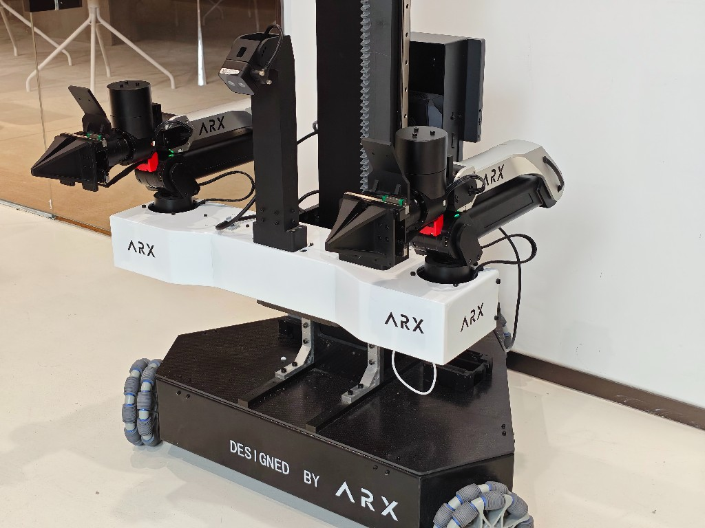

# ARX Lift2S / ACone 机械臂 ROS2 部署工作空间



本仓库用于部署 ARX Lift2S（含升降）与 ACone / X5 机械臂的 ROS 2 工作空间，基于 OCS2 MPC 控制框架。

## 目录

1. [前置条件](#1-前置条件)
2. [部署](#2-部署)
   - [2.1 方式概览](#21-方式概览)
   - [2.2 发布包部署（deb，推荐现场）](#22-发布包部署deb推荐现场)
   - [2.3 完整源码：克隆与子模块](#23-完整源码克隆与子模块)
3. [环境配置（RMW Zenoh）](#3-环境配置rmw-zenoh)
4. [编译](#4-编译)
   - [4.1 依赖安装](#41-依赖安装)
   - [4.2 程序编译（推荐：`quick_start.sh`）](#42-程序编译推荐quick_startsh)
5. [启动（请用 quick_start）](#5-启动请用-quick-start)
   - [5.1 仿真 / 可视化](#51-仿真--可视化)
   - [5.2 真机启动](#52-真机启动)
   - [5.3 手柄遥操作（Joystick Teleop）](#53-手柄遥操作joystick-teleop)
   - [5.4 Viser 与 VR 遥操作](#54-viser-与-vr-遥操作)
6. [子模块说明](#6-子模块说明)

## 1. 前置条件

- 已配置 Git SSH 密钥并可访问相关私有仓库
- 系统已安装 Git（建议 2.30+）
- ROS 2 Jazzy（Ubuntu 24.04）

## 2. 部署

### 2.1 方式概览

| 方式 | 适用场景 | 主要步骤 |
|------|----------|----------|
| **发布包（推荐现场）** | 机器人本体 / 产线，控制器与 HI 由 deb 提供 | 解压 zip → `release.sh --install` → `quick_start.sh` |
| **完整源码** | 开发、调试、改控制器栈 / HI | `./init_repo.sh`（source/deb 菜单）→ `quick_start.sh` |

发布包内**仅保留 `robot-descriptions-arx` 源码**，以及预下载的三类 deb（ocs2、robot-descriptions-common、**arms-ros2-control-full**）。`arx-ros2-control` 等目录在打包时已清空为占位，真机 HI（`arx_ros2_control`）由 **arms-full deb** 提供。

#### 目录结构（节选）

```
lift2s-ws/
  ├─ init_repo.sh              # 子模块初始化（source/deb 菜单；--init-release 仅描述）
  ├─ release.sh                # deb 安装、发布打包（维护者）
  ├─ quick_start.sh            # 编译与启动
  ├─ config/quick_start.conf   # RELEASE_SUBMODULE_PATHS 等
  ├─ deb_versions.conf         # 发布 deb 固定 tag（conf 通道）
  ├─ .deb_cache/               # 发布包内预置 deb（解压后安装）
  └─ src/
      ├─ robot-descriptions-arx      # 发布包保留源码
      ├─ arx-ros2-control            # 占位（HI 由 arms-full deb 提供；开发可 init 源码）
      ├─ robot-descriptions-common   # 发布包中由 deb 提供
      ├─ arms_ros2_control           # 发布包中由 deb 提供（full 含 arx_ros2_control）
      └─ ocs2_ros2                   # 发布包中由 deb 提供
```

### 2.2 发布包部署（deb，推荐现场）

从维护者处获取 `lift2s-ws_*.zip` 后，在目标机器上：

```bash
unzip lift2s-ws_*.zip -d ~
cd ~/lift2s-ws

# 1) 安装预置 deb（需 sudo；若 .deb_cache/ 为空或需更新，先 ./release.sh --download）
./release.sh --install
source /opt/ros/jazzy/setup.bash   # 若尚未写入 shell 配置

# 2) 编译工作区内描述包，再启动
./quick_start.sh
#   Build → 1) 仿真 / 2) 真机：deb 模式下均只编 ARX 描述包（HI 来自 arms-full deb）
#   Launch → Lift2S 分体 / 全身 等
```

`release.sh --install` 会按顺序安装 `.deb_cache/` 中的 deb：

1. `ros-jazzy-ocs2`（[legubiao/ocs2_ros2](https://github.com/legubiao/ocs2_ros2/releases)）
2. `ros-jazzy-robot-descriptions-common`（[fiveages-sim/robot-descriptions-common](https://github.com/fiveages-sim/robot-descriptions-common/releases)）
3. `ros-jazzy-arms-ros2-control-full`（[fiveages-sim/arms_ros2_control](https://github.com/fiveages-sim/arms_ros2_control/releases)，**含 arx_ros2_control HI**）

deb 三通道（默认打包为 **conf**，读取 `deb_versions.conf` 固定 tag）：

| 通道 | 说明 |
|---|---|
| **conf** | `deb_versions.conf` 固定 tag（发布打包默认） |
| **latest** | 各仓库 GitHub Latest 正式版 |
| **pre-release** | 滚动 pre-release |

```bash
./release.sh --download --release-channel latest
./release.sh --install
```


#### 部署后更新（git + deb）

发布 zip **包含主仓 `.git`** 时，可在现场拉取脚本与配置；大组件仍通过 deb 更新。

```bash
cd ~/lift2s-ws
git pull --ff-only
./init_repo.sh --init-release    # 或 --update-release
./release.sh --download
./release.sh --install
./quick_start.sh   # Build → 仿真/真机（deb 模式只编描述）后启动
```

由 deb 提供的子模块目录在发布包中为占位（`.gitkeep`）；若需完整源码开发，见下方 [2.3](#23-完整源码克隆与子模块)。

<details>
<summary><strong>维护者：生成发布 zip</strong></summary>

在开发机上（需 git、rsync 与网络）。打包在**临时目录**进行，**不修改**当前工作区。保留子模块由 `config/quick_start.conf` → `RELEASE_SUBMODULE_PATHS` 决定（当前仅 `robot-descriptions-arx`）。

```bash
cd ~/lift2s-ws
./release.sh --package --release-channel conf              # 含 .git，deb 架构=本机，默认 conf
./release.sh --package-no-git --arch amd64                 # 不含 .git，x64
./release.sh --package-no-git --arch arm64                 # 不含 .git，ARM
./release.sh --package --update-submodules                 # 打包时拉取保留子模块最新
./release.sh --package --release-channel pre-release       # 打入 pre-release deb
```

产物：`dist/lift2s-ws_<YYYYMMDD_HHMMSS>_<架构>[_nogit].zip`。

</details>

### 2.3 完整源码：克隆与子模块

#### 克隆到 ~/lift2s-ws

```bash
cd ~
git clone git@github.com:fiveages-sim/open-deploy-ws.git arx-ws
cd ~/lift2s-ws
```

#### 初始化并更新子模块

```bash
./init_repo.sh
```

交互菜单支持逐模块 **source ↔ deb**、deb 三通道（conf / latest / pre-release）、arms 变体（默认 **full**）。  
发布包现场更新描述可用：

```bash
./init_repo.sh --init-release     # 仅 init robot-descriptions-arx
./init_repo.sh --update-release   # 拉取描述子模块最新
```

`arms=deb(full)` 时跳过 `src/arx-ros2-control`；`arms=standard` 或 `arms=source` 时会 init HI 源码并检查 external 依赖。

#### 之后如何更新子模块

```bash
git submodule update --remote
```


## 3. 环境配置（RMW Zenoh）

部署机器建议使用 RMW Zenoh，避免局域网 DDS 互相污染。

* 安装
  ```bash
  sudo apt install ros-jazzy-rmw-zenoh-cpp
  ```
* 配置 bashrc
  ```bash
  export RMW_IMPLEMENTATION=rmw_zenoh_cpp
  ```
* 临时取消：`unset RMW_IMPLEMENTATION`
* **先起 Zenoh router，再 launch**（否则 `controller_manager` 会卡在
  `Waiting for data on 'robot_description' topic`）
  - 推荐：`./quick_start.sh` → Launch（会自动预启 router）
  - 手动 `ros2 launch` 时先另开终端：`ros2 run rmw_zenoh_cpp rmw_zenohd`

## 4. 编译

### 4.1 依赖安装

```bash
cd ~/lift2s-ws
rosdep install --from-paths src --ignore-src -r -y
```

### 4.2 程序编译（推荐：`quick_start.sh`）

完成 [§2 部署](#2-部署) 后（发布包已 `release.sh --install`，或完整源码已 `./init_repo.sh`）：

```bash
cd ~/lift2s-ws
./quick_start.sh
```

- **`1) 编译 (Build)`**
  - **`1) 仿真所需包`**：完整源码编控制器+描述；**deb 模式（含 arms-full）只编 3 个 ARX 描述包**
  - **`2) 真机所需包`**：完整源码编 `arx_ros2_control`+控制器+描述；**deb+arms-full 时与仿真相同（只编描述，HI 来自 deb）**；arms-standard 时另编源码 `arx_ros2_control`

包列表见 `config/quick_start.conf`（`BUILD_*` / `BUILD_DEB_*`）。

<details>
<summary><strong>（可选）手动编译命令</strong></summary>

```bash
cd ~/lift2s-ws
# 仿真
colcon build --packages-up-to \
  ocs2_arm_controller \
  arx_acone_description \
  arx_lift2s_description \
  arx5_description \
  arms_teleop \
  adaptive_gripper_controller \
  basic_joint_controller \
  --symlink-install

# 真机（需 src/arx-ros2-control/external/{arx5-sdk,arx_lift_src}）
colcon build --packages-up-to \
  arx_ros2_control \
  ocs2_arm_controller \
  arx_acone_description \
  arx_lift2s_description \
  arx5_description \
  arms_teleop \
  adaptive_gripper_controller \
  basic_joint_controller \
  --symlink-install

# 发布包 / deb 模式（已 release.sh --install；arms-full 含 HI，勿编 arx_ros2_control）
colcon build --packages-up-to \
  arx5_description \
  arx_acone_description \
  arx_lift2s_description \
  --symlink-install
```

</details>

## 5. 启动（请用 quick_start）

### 5.1 仿真 / 可视化

```bash
source ~/lift2s-ws/install/setup.bash
ros2 launch robot_common_launch manipulator.launch.py robot:=arx_acone
ros2 launch robot_common_launch manipulator.launch.py robot:=arx_lift2s
```

推荐用 `./quick_start.sh` → **`2) 启动`**：

| 选项 | 说明 |
|------|------|
| 1) 单臂 X5 | `robot:=arx5`；**真机时再选左臂(can1) / 右臂(can3)** |
| 2) 双臂 ACone | `robot:=arx_acone`（can1 + can3） |
| 3) Lift2S 分体 | `split_body.launch.py`；真机可选升降 hybrid / soft_p |
| 4) Lift2S 全身 | `full_body.launch.py`；同上 |

运行模式：真机 / 真机 headless / 仿真 / 仿真 headless / Isaac / Isaac headless / 仅可视化。

### 5.2 真机启动

**臂控制模式：仅 `full_control`（MIT MIX）**

- 电机层始终是 MIT 阻抗（`kp, kd, pos, vel, torque`），部署脚本**不再提供**臂 `position` 菜单。
- 单臂真机：`xacro_can_interface:=can1`（左）或 `can3`（右）。
- 双臂 / Lift2S：左右固定 can1 / can3。

**升降（仅 Lift2S）**

- `hybrid`（默认）：`sendLiftHybrid`，跟踪 pos+vel，HI 重力/摩擦前馈。
- `soft_p` / `position`：仅跟踪 position（直跟）；升降与底盘分开发；持高靠 `soft_p_kp`，不加重力前馈。

```bash
./quick_start.sh
# Build → 2) 真机包
# Launch → 1) 单臂 → 真机 → 选左/右
# Launch → 3/4) Lift2S → 真机 → 升降模式（默认 hybrid）
```

<details>
<summary><strong>（可选）手动启动真机</strong></summary>

```bash
source ~/lift2s-ws/install/setup.bash
# RMW=zenoh 时先另开终端：ros2 run rmw_zenoh_cpp rmw_zenohd

# 单臂左 / 右
ros2 launch ocs2_arm_controller demo.launch.py robot:=arx5 hardware:=real xacro_can_interface:=can1
ros2 launch ocs2_arm_controller demo.launch.py robot:=arx5 hardware:=real xacro_can_interface:=can3

# 双臂
ros2 launch ocs2_arm_controller demo.launch.py robot:=arx_acone hardware:=real

# Lift2S 分体 / 全身（升降默认 hybrid）
ros2 launch ocs2_arm_controller split_body.launch.py robot:=arx_lift2s hardware:=real
ros2 launch ocs2_arm_controller full_body.launch.py robot:=arx_lift2s hardware:=real \
  xacro_lift_motor_mode:=hybrid
```

</details>

### 5.3 手柄遥操作（Joystick Teleop）

手柄遥操与机器人控制进程**分开启动**（与 [panthera-ht](https://github.com/fiveages-sim/open-deploy-ws/tree/panthera-ht) 相同）：先开单臂/双臂/Lift2S 控制，再开手柄节点。

**依赖**

- 控制栈已编译（`arms_teleop` 在 `BUILD_LIFT2S_*` / `BUILD_ALL_SIM_PACKAGES` 中；发布包由 **arms-full deb** 提供）
- 若未安装 joy 包：

```bash
sudo apt install ros-jazzy-joy
```

**用法**

1. **终端 A**：启动控制（仿真或真机），例如 `./quick_start.sh` → `2) 启动` → 单臂 X5 / 双臂 ACone / Lift2S 分体或全身
2. **终端 B**：`./quick_start.sh` → **`2) 启动`** → **`5) 手柄遥操作 (Joystick Teleop)`**（多手柄时会枚举设备）

或手动：

```bash
source ~/lift2s-ws/install/setup.bash
# RMW=zenoh 时先另开终端：ros2 run rmw_zenoh_cpp rmw_zenohd

ros2 launch arms_teleop joystick_teleop.launch.py
# 多手柄时指定设备：
# ros2 launch arms_teleop joystick_teleop.launch.py joy_dev:=/dev/input/js1
```

手柄节点发布 `control_input`，由 launch 中已随 `ocs2_arm_controller` 启动的 **`arms_target_manager`** 转换为末端目标；**需先切到 OCS2 状态**（见下表 LB 组合键）才会跟踪位姿。

**常用操作（SDL 标准布局 / Xbox 类手柄）**

| 操作 | 说明 |
|------|------|
| **右摇杆按下** | 启用 / 禁用遥操（默认禁用） |
| **LB + A** | → HOME |
| **LB + B** | → HOLD |
| **LB + START** | → OCS2（进入 MPC 后再拖末端） |
| **LB + Y** | → MOVEJ |
| **左 / 右摇杆** | 平移 / 旋转（启用遥操后） |
| **A** | 切换左 / 右臂（双臂 / Lift2S） |
| **X** | 夹爪开 / 关 |
| **LT / RT** | 夹爪开合比例 |
| **左摇杆按下** | 切换高 / 低速档 |

手柄遥操详细说明（映射文件、未 Mapped 设备校准等）见 [arms_teleop README](https://github.com/fiveages-sim/arms_ros2_control/tree/main/command/arms_teleop)。

### 5.4 Viser 与 VR 遥操作

Viser 可视化与 VR 遥操由独立仓库 **[fa-py-libraries](https://github.com/fiveages-sim/fa-py-libraries)** 提供（`ros2-viser`、`vr_pose_publisher`、`ros2_robot_interface`），**不在 `lift2s-ws` 发布 zip 内**。Lift2S 侧控制栈通过 `arms_target_manager` 的 **`VRInputHandler`** 订阅 `/xr/*` 话题。

#### 一次性准备（fa-py-libraries）

需先完成 lift2s-ws §2 部署与 §4 编译（存在 `~/lift2s-ws/install/setup.bash`）。

```bash
cd ~
git clone git@github.com:fiveages-sim/fa-py-libraries.git
cd ~/fa-py-libraries

# 1) 子模块 + Python 环境 + 安装
./init.sh all

# 2) 配置 ROS2 工作空间（交互提示时输入 ~/lift2s-ws）
#    会写入 .fa-env.toml 与 activate 挂钩；之后 run.sh 会自动 source lift2s-ws
./init.sh ros2-workspace
```

也可 `./init.sh` 进入菜单 → **10) 配置 ROS2 工作空间**（效果相同）。个人覆盖可用 `.fa-env.local.toml`（见 [fa-py-libraries README](https://github.com/fiveages-sim/fa-py-libraries)）。

#### 典型流程

1. **终端 A（lift2s-ws）**：启动机器人控制（仿真 / 真机均可）  
   `./quick_start.sh` → 启动 → 单臂 / 双臂 / Lift2S 分体或全身  
   控制栈会自动拉起 `arms_target_manager`（含 VR 输入处理）。
2. **终端 B（fa-py-libraries）**：启动 Viser 或 VR（`run.sh` 会按上一步配置自动 source lift2s-ws）：

```bash
cd ~/fa-py-libraries
./run.sh viser          # 3D 可视化（ros2-viser）
./run.sh vr             # VR 遥操（Vuer / WebXR，发布 /xr/*）
```

3. **VR 控制前**：在 VR 或手柄菜单中将 FSM 切到 **OCS2**（VR 面键 / 组合键，或终端 A 用手柄 **LB + START**）。`VRInputHandler` 检测到 `/xr_target_node` 存在后才会启用 VR 跟踪。

**VR 话题（由 `vr_pose_publisher` 发布，Lift2S 控制栈订阅）**

| 话题 | 说明 |
|------|------|
| `/xr/left_ee_pose`、`/xr/right_ee_pose` | 左 / 右手柄位姿 |
| `/xr/head_pose` | 头显位姿 |
| `/xr/controller_state` | 面键 / 组合键事件 |
| `/xr/thumbstick_axes` | 摇杆轴 |
| `/xr/trigger_values` | 扳机 |

Lift2S 固定基座场景一般不使用 VR 底盘模式；升降仍以控制栈 / 分体 `body_joint_controller` 或全身 WBC 为准。

**环境**

- 两仓均建议使用 §3 的 **RMW Zenoh**；手动 launch 时需先起 `rmw_zenohd`。
- Viser 以及 VR 遥操使用，详见 [fa-py-libraries](https://github.com/fiveages-sim/fa-py-libraries)。

## 6. 子模块说明

- **robot-descriptions-arx** — ARX 机型描述（`arx5` / `arx_acone` / `arx_lift2s`）；**发布包唯一保留源码**
- **arx-ros2-control** — 真机 HI（`ArxX5Hardware` + `ArxLiftHardware`）；**发布包由 arms-full deb 提供**；开发可选源码
- **arms_ros2_control** — 机械臂通用 ROS2 控制（OCS2 控制器、遥操作等）；deb **full** 含 `arx_ros2_control`
- **ocs2_ros2** — OCS2 的 ROS2 版本（MPC）；发布包由 deb 提供
- **robot-descriptions-common** — 通用组件与 launch；发布包由 deb 提供
